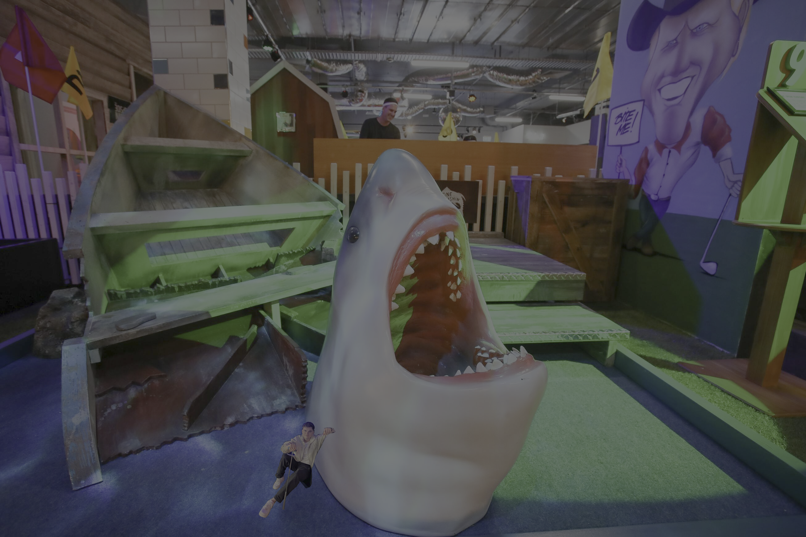

## Aleksa Profile 

<h1 align = "center">Hi there, I’m Aleksa. </h1>

I am a PhD candidate :microbe: working on synthetic cell models :test_tube: to answer important biological questions :brain:. My work has taken me to the intersection of wet-lab biology :microscope: and data science :computer:, and as a Dezerae-taught pythonista :snake: I am always looking for new things to learn  :mortar_board:. Head [here](insert link) to find out a little more about my science :woman_scientist:,  otherwise read on for more about my code creations :woman_technologist:. 

### [Publication repositories](README_complete.md/#publication-repositories)

For a detailed list of my publications, you can find my full CV [here](insert link). If you're more interested in the code, below are some of the open-access repositories that accompany recent manuscripts I've been involved in. 

<!--
**aleksa23q/aleksa23q** is a ✨ _special_ ✨ repository because its `README.md` (this file) appears on your GitHub profile.

Here are some ideas to get you started:

- 🔭 I’m currently working on ...
- 🌱 I’m currently learning ...
- 👯 I’m looking to collaborate on ...
- 🤔 I’m looking for help with ...
- 💬 Ask me about ...
- 📫 How to reach me: ...
- 😄 Pronouns: ...
- ⚡ Fun fact: ...
-->
